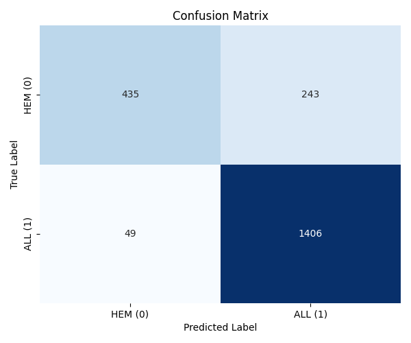
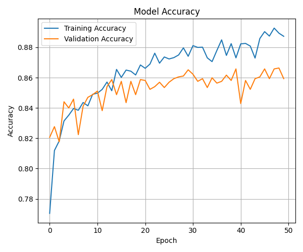
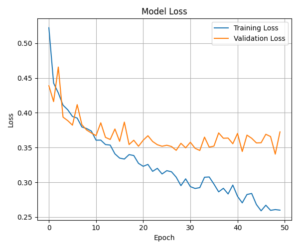

#Leukemia Classification using ResNet50  
#Project Overview   
This project develops an image classification model to detect Acute Lymphoblastic Leukemia (ALL) from microscopic blood smear images. It utilizes transfer learning with the ResNet50 convolutional neural network to classify images as either ALL (leukemia) or HEM (healthy).   

#Key Features   
Automated Image Preprocessing: Includes steps like CLAHE for contrast enhancement, Otsu's thresholding for segmentation, smart cropping to focus on cells, and resizing.  

Transfer Learning: Leverages a pre-trained ResNet50 model (on ImageNet) as a powerful feature extractor.  

Deep Learning Model: A Keras sequential model built on ResNet50 with custom classification layers and dropout for regularization.  

Optimized Training: Uses Adam optimizer, binary_crossentropy loss, Early Stopping, and Model Checkpointing.  

Performance Evaluation: Provides test accuracy, classification report, and confusion matrix.  

Training Visualization: Plots model accuracy and loss history.  

Dataset  
The model is trained on the C-NMC Leukemia dataset, containing ALL and HEM blood smear images.  

Dataset Source: Kaggle - Leukemia Classification (C-NMC)  

Results  
The model effectively classifies leukemia images, achieving a test accuracy of approximately 86.31%.  

Test Loss: 0.3423  
Test Accuracy: 0.8631  

Classification Report:  
              precision    recall  f1-score   support

           0       0.90      0.64      0.75       678
           1       0.85      0.97      0.91      1455

    accuracy                           0.86      2133
   macro avg       0.88      0.80      0.83      2133  
weighted avg       0.87      0.86      0.86      2133  
   
Confusion Matrix:  
[[ 435  243]  
 [  49 1406]]

 
 
 
